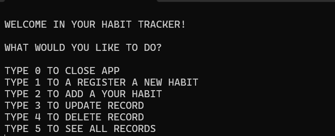
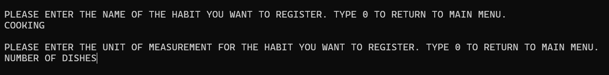
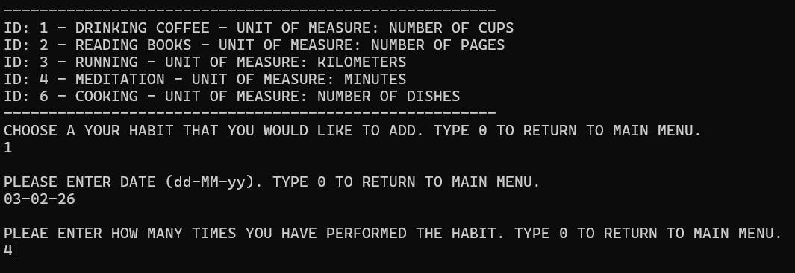
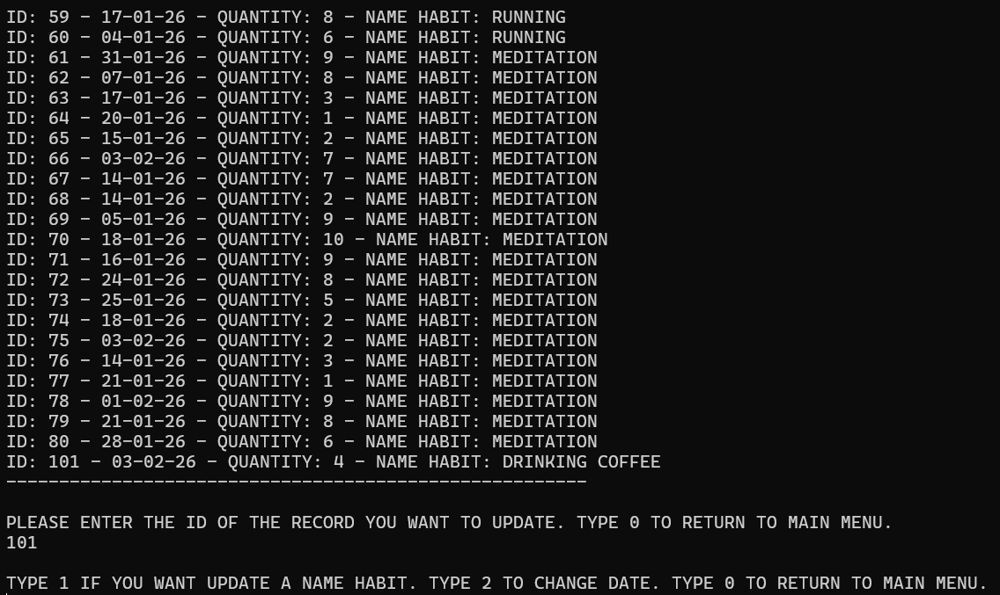
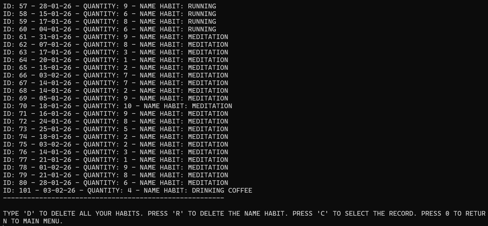
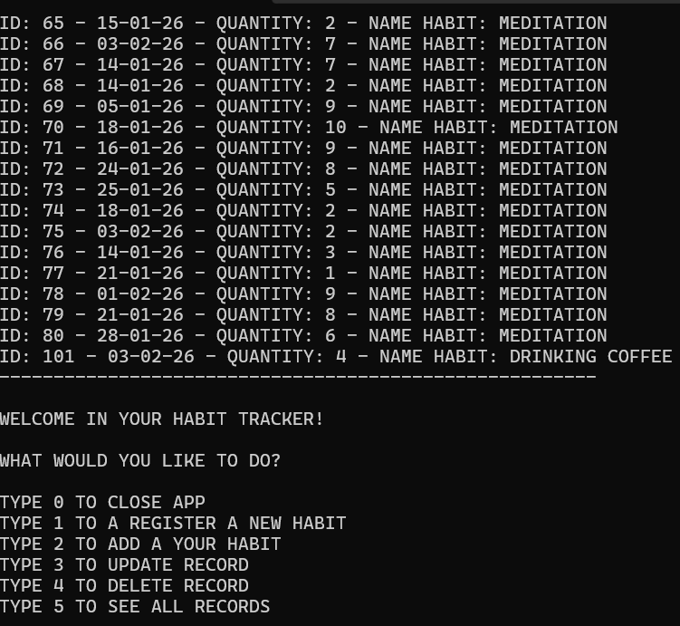

# HABIT-TRACKER

Habit Tracker is my first C# application using SQLite to monitor daily habits.

It is a full CRUD (Create, Read, Update, Delete) application designed to help users manage and track their progress efficiently.

## Key features

- **Habit Registration**: register new habits with specific names and units of measurement.
- **Quantitative Tracking**: all habits are managed based on quantity (e.g., liters of water, kilometers run).
- **CRUD application**: the application allows to add, view, modify and delete habits
- **Persistent Storage**: Uses SQLite via ADO.NET to record and manage data.
- **Auto-Database Initialization**: On startup, the application automatically creates the SQLite database if it doesn't already exist.
- **Seed Data**: The app generates random default habits upon first launch to facilitate immediate testing.
- **Robust Error Handling**: The application is designed to catch and handle errors gracefully.
- **Console UI**: A simple, intuitive, and menu-driven command-line interface.
	-		

## Functionality & Usage

From the main menu, you can navigate the following features:

- **Registration and insertion**
	-	**Register a New Habit (Type '1')**: Define a new habit by entering its name and unit of measure.
	-	  
	-	**Add a Record (Type '2')**: Log an entry for a specific habit by entering the date and quantity.
	-	
	-	**Date Format**: The application ensures that dates are entered in the correct dd-MM-yy format.
		-	**Numeric Validation**: It verifies that only numbers are entered for quantities, preventing invalid data entry.
	-	 **Seamless Navigation**: The user can return to the main menu at any time during the process.

- **Update record**
	-	**Update Records (Type '3')**: Modify existing data. You can change the habit name, update a specific date, or return to the menu.
	-	
	-	The program offers flexible update options to keep your data accurate:
		-	**Change Habit Name**: Modify the name of an existing habit.
		-	**Update Date Only**: Adjust the date of a specific record without changing other details.
		-	**Menu Navigation**: You can exit the update process and return to the main menu at any time. 

- **Delete record**
	-	**Delete Records (Type '4')**: Remove data with multiple options: delete all habits, delete a specific record, or delete a single habit category.
	-	
	-	The application provides several ways to manage and remove your data:
		-	**Delete All Records**: Wipe all habit data from the database.
		-	**Delete All Entries for a Specific Habit**: Clear the history of a single habit while keeping the habit itself.
		-	**Select and Delete a Specific Habit**: Remove a habit category and all its associated data.
		-	**Menu Navigation**: Cancel the operation and return to the main menu.
	
- See all records
	-	**View Records (Type '5')**: Display a complete list of all registered habits and logs.
	-	

## What I Learned

-	Database Integration: I learned how to create, connect, and communicate with a database using ADO.NET.
-	Problem Solving: Implementing logic to generate random test records was a rewarding challenge that helped me ensure the app's stability.
-	Code Organization: I improved my use of classes and methods to keep the codebase clean, modular, and maintainable.
-	Unit Testing: I learned the importance of writing unit tests to verify that methods behave as expected.

